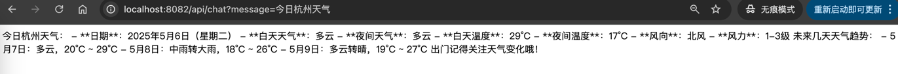
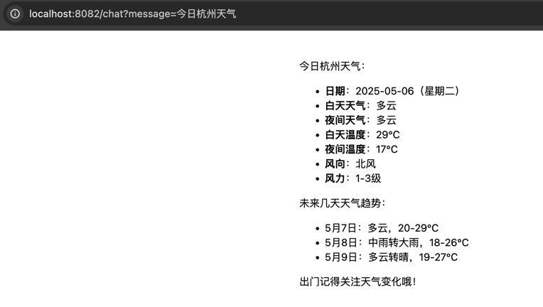
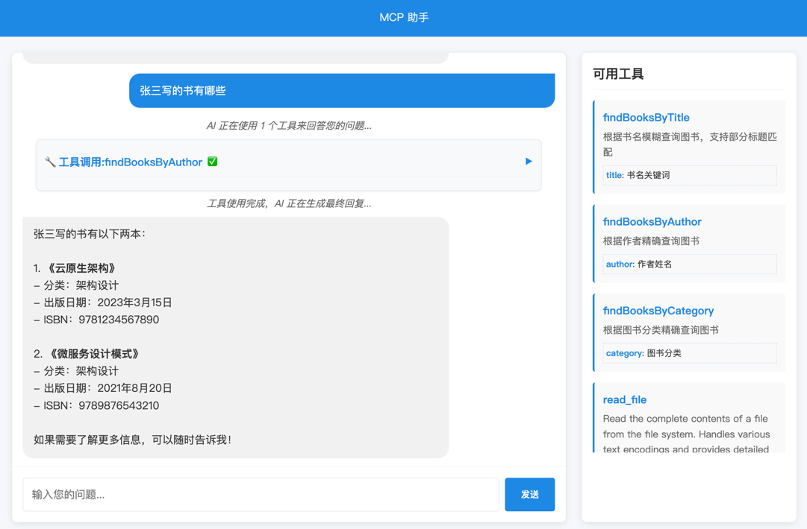
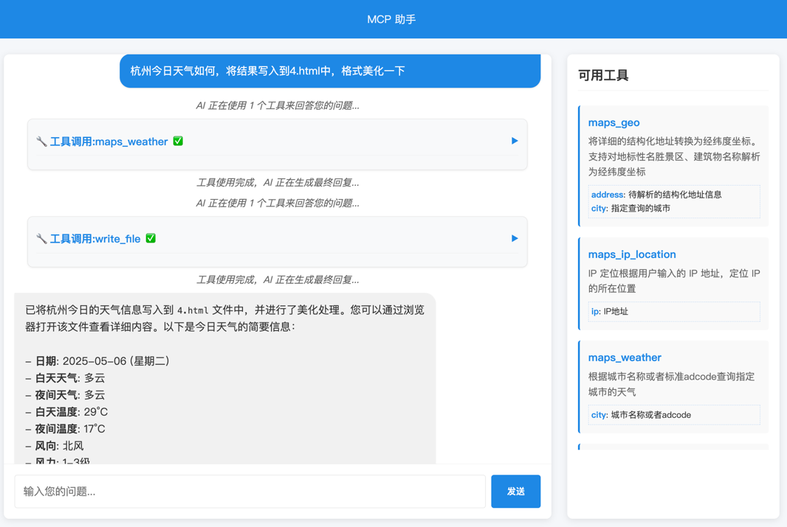
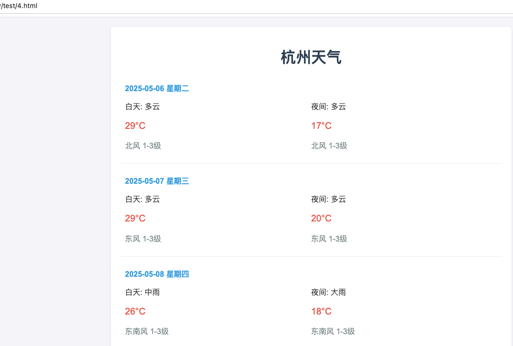
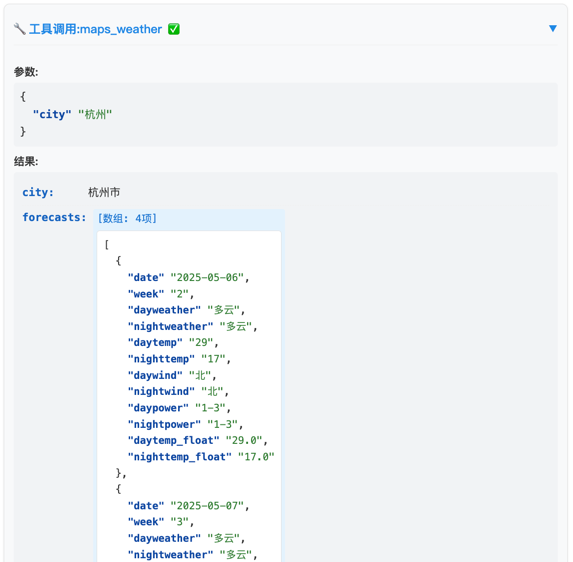
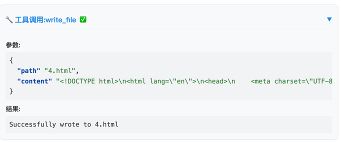
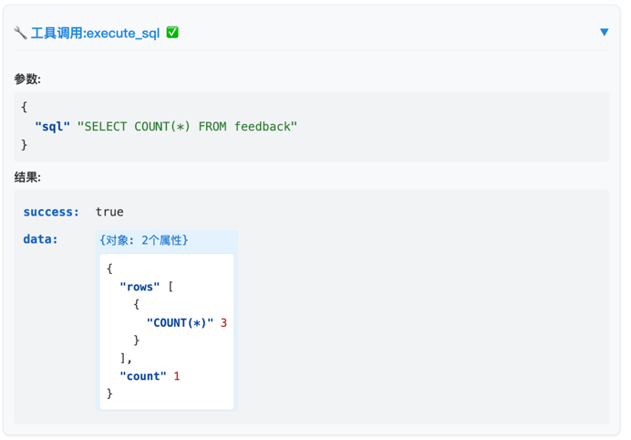

## 说明

mcp-client 和 call-mcp 模块中的 application.properties 配置文件:

    spring.ai.openai.api-key=你的deepseek api key

## MCP 服务端

启动 mcp-server 模块，端口 8085

http://localhost:8085/sse

## MCP 客户端

### ★ 文本客户端：

启动 mcp-client 模块，端口 8082

示例：http://localhost:8082/api/chat?message=%E4%BB%8A%E6%97%A5%E6%9D%AD%E5%B7%9E%E5%A4%A9%E6%B0%94

示例：http://localhost:8082/chat?message=%E4%BB%8A%E6%97%A5%E6%9D%AD%E5%B7%9E%E5%A4%A9%E6%B0%94

### ★ 流式客户端：

启动 call-mcp 模块，端口 8083

访问入口：http://localhost:8083/

说明：右侧展示了当前 client 客户端注册的 MCP 工具列表。

工具调用的效果，格式化如下:

